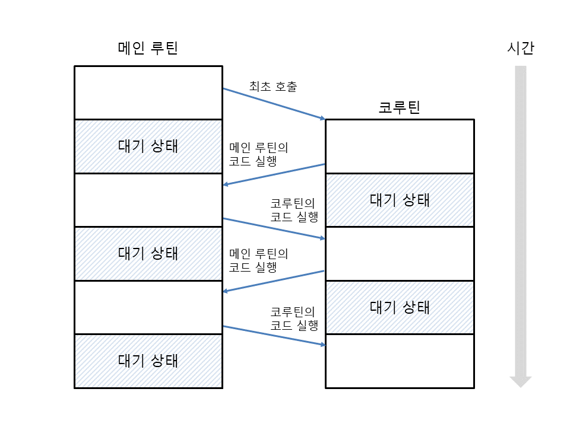

## 코루틴(coroutine) 이란
cooperative routine을 의미하는데 서로 협력하는 루틴이라는 뜻이다. 보통 메인루틴에서 서브 루틴을을 호출하면 서브 루틴의 코드를 실행한 뒤 다시 메인 루틴으로 돌아온다. 특히 서브 루틴이 끝나면 서브 루틴의 내용은 모두 사라지는 메인 루틴에 종속된 관계이다. 하지만 코루틴의 경우 메인 루틴과 서브 루틴처럼 종속된 관계가 아니라 서로 대등한 과계이며 특정 시점에 상대방의 코드를 실행한다.

</img>

## 코루틴의 네가지 상태
`inspect.getgeneratoerstate()` 함수를 이용해서 현재 상태를 알 수 있다.
- `GEN_CREATED`: 실행을 시작하기 위해 대기하고 있는 상태
- `GEN_RUNNING`: 현재 인터프리터가 실행하고 있는 상태
- `GEN_SUSPENDED`: 현재 yield 문에서 대기하고 있는 상태
- `GEN_CLOSED`: 실행이 완료된 상태

## 단일 스레드에서의 코루틴
코루틴을 사용하는 이벤트 주도 프로그래밍 환경에서는 코루틴이 반복적으로 핵심 루프에 제어권을 넘겨주어 핵심루프가 다른 코루틴을 활성화하고 실행할 수 있게 해줌으로써 작업을 동시에 실행한다. 이런 방식의 협업 멀티태스킹 황경에서는 코루틴이 중앙 스케줄러에 자발적으로 제어권을 넘겨준다. 이와 반대로, 스레드는 선점형 멀티태스킹을 구현한다. 선점형 멀티태스킹은 스케줄러가 언제든 스레드를 중단하고 다른 스레드를 실행할 수 있다.

## 읽을거리 
- [ipython-yf](https://github.com/tecki/ipython-yf)
- [GIL 락을 해제할 수 있는가?](http://bit.ly/1HGtb0F)
- [GIL을 제거하는 것은 간단하지 않다.](http://bit.ly/1JIvgwd)
- [파이썬 쓰래드와 GIL](http://www.dabeaz.com/GIL/)
- [python-parallelize library](http://bit.ly/1HGtF6Q)